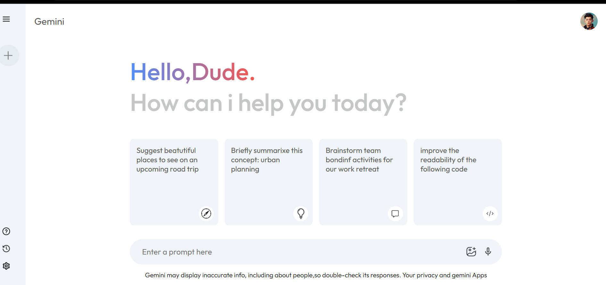

## 🧩 Project Overview

**Project Title:** AI Chat Box – Gemini Clone  

This project was developed as part of my personal learning and portfolio showcase.  
It replicates the design and basic behavior of Google’s Gemini AI chat interface using **React** and **Vite**.  
The goal of this project is to demonstrate my skills in **modern frontend development**, **responsive UI design**, and **clean, maintainable code structure**.

---

## 🧠 Tech Stack
- ⚛️ React (Frontend Framework)  
- ⚡ Vite (Development Environment)  
- 🧠 JavaScript, HTML, CSS  
- 🎨 React Icons / Lucide React  

---

## 🖼️ Project Preview
Here’s a preview of the AI Chat Box interface:

---

## ⚠️ License & Usage Notice
This project is created solely for **educational and portfolio demonstration purposes**.  
Any form of **reproduction, redistribution, or commercial use** without permission is strictly prohibited.  

© 2025 **Vijayakumar J** — All Rights Reserved
